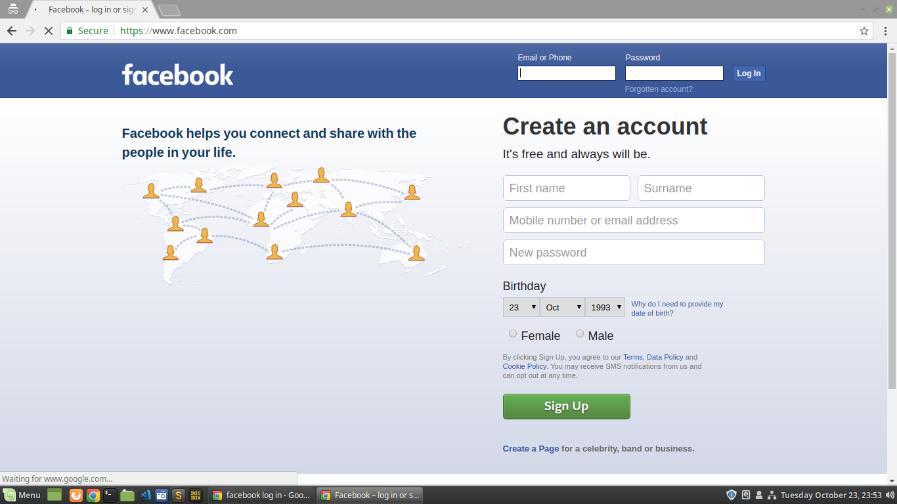
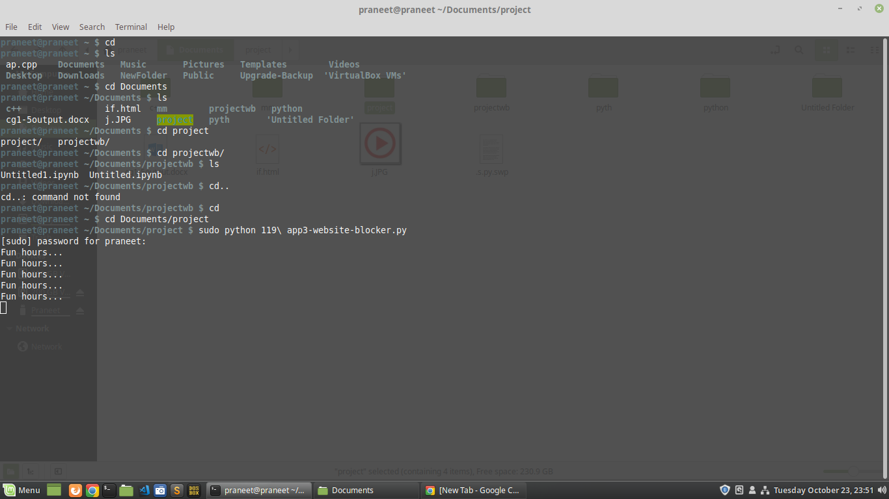
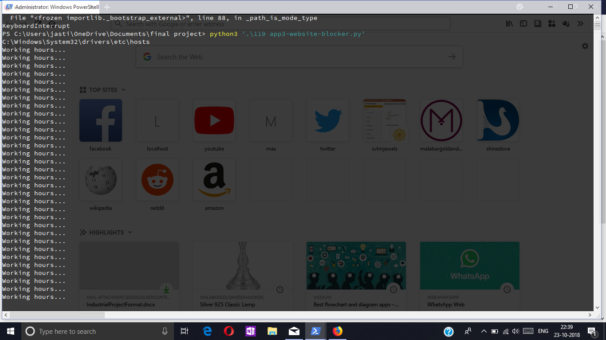
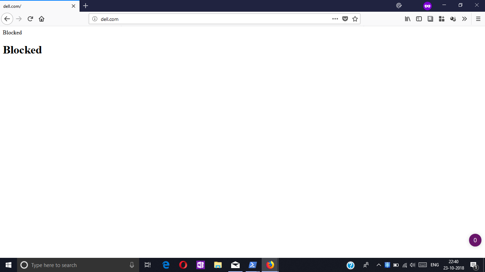

# Focustimer
An website blocker build in python.
It is build to enhance the productivity of the person while working as it can block the website url that is stored in the list.
date time modules are use for tracking the time.
## => when work not done.
### when website is not blocked

### internal  working through terminal.

## => when working hours.

### internal  working through terminal.

### it will address to localhost and shows the message in the html file .i.e. blocked.

